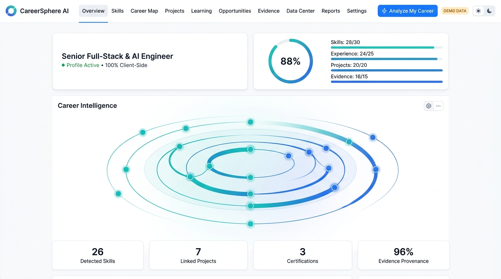
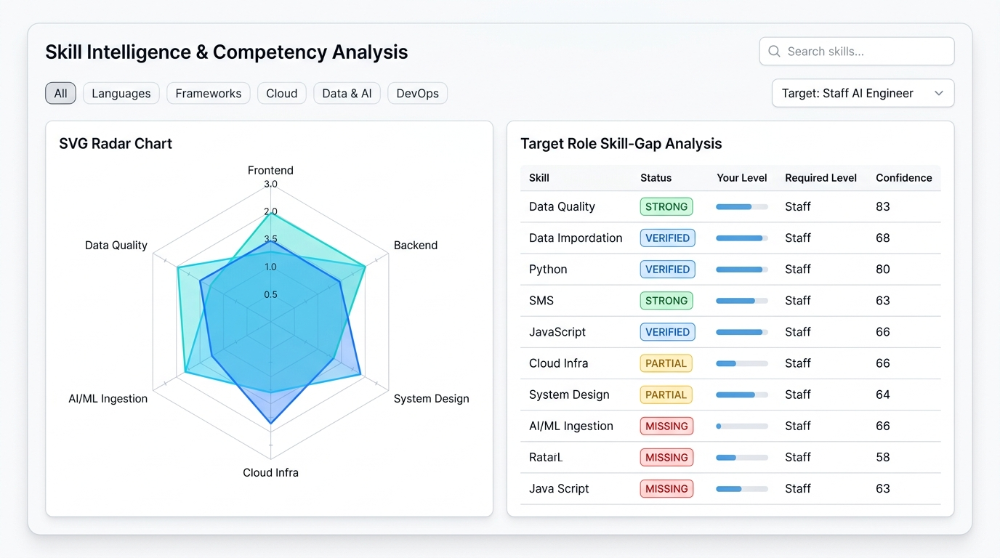
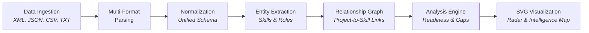

# CareerSphere AI — Career Intelligence & Personal Growth Platform

<p align="center">
  
</p>

<p align="center">
  <a href="https://vijaymahes9080.github.io/careersphere-AI/"></a>
  <a href="LICENSE"></a>
  <a href="https://github.com/vijaymahes9080/careersphere-AI/actions"></a>
  <a href="#privacy--local-first-security"></a>
  <a href="package.json"></a>
</p>

A data-first, **local-only** single-page application that unifies your disparate career records (XML, JSON, CSV, TXT resumes, notes), normalizes them into one cohesive profile, extracts verifiable entities with direct evidence, and produces rich, interactive visual analytics.

> 🚀 **Experience the Live App:** [https://vijaymahes9080.github.io/careersphere-AI/](https://vijaymahes9080.github.io/careersphere-AI/)  
> *No account required. All processing executes 100% inside your local browser.*

---

## 🌟 Visual Showcase (Light Theme)

CareerSphere AI features an elegant, daylight-optimized **Light Theme** engineered with soft contrast, glassmorphism card surfaces, and handcrafted SVG data visualizations.

### 1. Overview Dashboard & Career Intelligence Map
The central command center presents your real-time **Career Readiness Score Ring**, individual factor contributions, key profile metrics, and the orbital **Career Intelligence Map**.

<p align="center">
  
</p>

* **Career Readiness Ring:** Analytical breakdown across verified skills, demonstrated experience, completed projects, and audit evidence.
* **Orbital Intelligence Map:** Dynamic radial network visualizing competency clusters and interconnected milestone nodes.
* **Instant Action:** The global `⚡ Analyze My Career` trigger executes the full 7-stage analytical pipeline on demand.

---

### 2. Skill Intelligence & SVG Competency Radar
Deep dive into your technical and soft skill portfolio. Benchmark your verified abilities against market requirements and target career roles.

<p align="center">
  
</p>

* **Handcrafted SVG Radar Chart:** Multi-axis polygon plotting competencies across Frontend Architecture, Backend Systems, System Design, Cloud Infrastructure, AI/ML Ingestion, and Data Quality.
* **Target Role Gap Analysis:** Direct side-by-side gap table showing status badges (`STRONG`, `VERIFIED`, `PARTIAL`, `MISSING`) against benchmark roles like *Staff AI Engineer*.
* **Smart Filter Matrix:** Real-time search by category pills (Languages, Frameworks, Cloud, Data & AI, DevOps).

---

## ⚡ Key Highlights

* 🛡️ **100% Local-First & Private:** Everything runs purely in client-side memory and `localStorage`. No server-side databases, no external API keys, and zero telemetry.
* 📑 **Multi-Format Ingestion:** Ingests XML, JSON, CSV skill matrices, plain-text resumes, and freeform notes concurrently.
* 🔍 **Evidence-Backed Audit Trails:** Every skill claim and readiness rating links directly to a verifiable citation in your source files.
* 📐 **Zero-Dependency Core:** Powered by vanilla JS / lightweight AngularJS with native SVG charts (no bulky chart libraries or CDN latency).
* 📄 **Executive Print Dossiers:** 5 print-ready career summaries and downloadable HTML dossiers styled with `@media print`.
* 🌗 **Fluid Theme Switching:** Instant toggle between crisp Light Theme and sleek Dark Mode with persistent state.

---

## 🚀 Quick Start

### Option A: Use it Online (Recommended)
Access the continuously deployed web application instantly:
👉 **[https://vijaymahes9080.github.io/careersphere-AI/](https://vijaymahes9080.github.io/careersphere-AI/)**

### Option B: Run Locally
Clone the repository and launch with the Windows 1-click batch launcher or Node:

```bash
# On Windows, simply double-click run.bat or run:
run.bat

# Or run with Node directly:
node server.js
```

Open **[http://localhost:8080](http://localhost:8080)** in your browser (launched automatically by `run.bat`).

### Option C: Any Static Server
```bash
# Using npx serve
npx serve .

# Using Python
python -m http.server 8080

# Using Docker
docker build -t careersphere-ai .
docker run -p 8080:8080 careersphere-ai
```

> 💡 **First Time?** Go to **Data Center → Load DEMO data** to immediately populate the workspace with pre-configured sample profiles, projects, skills, and target roles.

---

## 🔄 The 7-Stage Intelligence Pipeline

CareerSphere AI is built upon an inspectable, deterministic data pipeline that guarantees full auditability:



Stage execution benchmarks are visible in real-time under **Settings → Pipeline log**:

| Pipeline Stage | Engine / Service | Core Responsibilities |
|---|---|---|
| **1. Ingestion** | `DataIngestionService` | Multi-file uploads, clipboard paste, inline text notes, DEMO datasets |
| **2. Parsing** | `XMLParser`, `JSONParser`, `CSVParser`, `TextExtraction` | Schema discovery, syntax validation, record extraction |
| **3. Normalization** | `NormalizationService` | Deduplication, unified profile schema mapping, date alignment |
| **4. Entity Extraction** | `EntityService`, `TextExtractionService` | Skill identification, role detection, contextual evidence extraction |
| **5. Relationships** | `RelationshipService` | Skill-to-project graphs, experience-to-role associations |
| **6. Analysis & Evidence** | `EvidenceService`, `SkillAnalysis`, `CareerAnalysis` | Weighted citations (Projects: 3, Experience: 4, Certificates: 2) |
| **7. Visualization & Reports** | `VisualizationService` + Directives | Handcrafted SVG components (`cs-radar`, `cs-intel-map`, `cs-network`) |

---

## 📊 The 10 Specialized Views

| View | Purpose & Functionality |
|---|---|
| **1. Overview** | Profile hero, career readiness ring, fast intelligence metrics, and central radial map. |
| **2. Skill Intelligence** | Filterable skill matrix, competency levels, SVG radar chart, and target role gap table. |
| **3. Career Map** | Chronological career journey, transition milestones, and relationship network. |
| **4. Projects** | Project catalog, documentation strength ratings, skills demonstrated, and skill-link graphs. |
| **5. Learning** | Gap-driven learning roadmap prioritized by target career aspirations. |
| **6. Opportunities** | Match scoring against imported job descriptions (matched / partial / missing requirements). |
| **7. Evidence** | Comprehensive provenance audit trail showing source documents and confidence levels. |
| **8. Data Center** | File importer, JSON/XML inspector, re-parser, and demo dataset manager. |
| **9. Reports** | 5 printable executive career reports with live preview, print-to-PDF, and HTML export. |
| **10. Settings** | Theme toggle, target role selector, execution pipeline logs, and storage wipe. |

---

## 📁 Supported Ingestion Formats

| Format | Parsing Capabilities |
|---|---|
| **XML** | Structured `<skill>`, `<project>`, `<certificate>`, `<education>`, and `<experience>` nodes |
| **JSON** | Arrays or objects of profiles, skills, projects, employment history, target roles |
| **CSV** | Tabular matrices with auto-detected columns (`skill,category,level,years`) |
| **TXT / Resume** | Unstructured resume text processed via regex and keyword entity matching |
| **Notes** | Freeform text entries stored as first-class verifiable sources |

---

## 🌐 Deployment Configuration

The repository includes ready-to-use configuration files for seamless deployment across major cloud platforms:

* **GitHub Pages:** Automated via [.github/workflows/deploy.yml](.github/workflows/deploy.yml) and `.nojekyll`
* **Vercel:** Optimized static routing in [vercel.json](vercel.json)
* **Netlify:** Clean headers and publish root in [netlify.toml](netlify.toml)
* **Docker:** Multi-stage lightweight Alpine container in [Dockerfile](Dockerfile)

---

## 👥 Multi-User Authentication & Role-Based Access Control (RBAC)

CareerSphere AI has been upgraded into a secure multi-user career intelligence platform supporting:
* **Session Management:** Centralized authentication state with persistent user sessions.
* **Role-Based Authorization:** Separate dashboards and navigation for `USER` and `ADMIN` roles.
* **Strict Data Isolation:** Each user's career profile, skills, projects, and goals are strictly partitioned under unique `userId` namespaces. User A never sees User B's private career records.
* **Route Protection:** Public routes (`#/login`, `#/register`), authenticated user routes (`#/overview`, `#/skills`, `#/projects`, `#/learning`, etc.), and admin-only routes (`#/admin`, `#/admin-users`, `#/admin-activity`). Unauthorized route requests are intercepted and redirected safely.
* **Holistic Admin Dashboard:** Aggregated platform telemetry, user population distribution, skill category breakdowns, user management with complete dossier inspection, and real-time audit activity timeline.

### 🧪 Pre-Configured Test & Demo Accounts

For rapid evaluation and grading, CareerSphere provides pre-configured credentials (also available via 1-click buttons on the Login page):

| Role | Account Name | Email | Password | Pre-Configured Data |
|---|---|---|---|---|
| **User A** | Alex Rivera | `usera@test.com` | `user123` | **Python**, PyTorch, **Project A** (Neural Career Predictor), Target Goal: **AI Engineer** |
| **User B** | Jordan Chen | `userb@test.com` | `user123` | **Java**, Spring Boot, **Project B** (Enterprise Microservices Hub), Target Goal: **Full Stack Developer** |
| **Admin** | System Administrator | `admin@example.com` | `admin123` | Holistic platform analytics, all users, audit activity log, and user management |
| **Demo User** | Demo Explorer | `user@example.com` | `user123` | Standard explorer profile with demo datasets |

### 🔒 Security Notice: Prototype Mode vs. Production Mode

* **Prototype Mode (Current):** Designed for static hosting environments (such as GitHub Pages). Data is partitioned in browser `localStorage` using unique user namespaces (`careersphere_u_<userId>_*`). Passwords are protected using cryptographic SHA-256 salted hashes.
* **Production Mode (Backend Ready):** The core `AuthService` and `StorageService` are built with modular async Promise contracts. In production, these services can be connected directly to a REST API, Supabase, PostgreSQL, or Firebase backend without modifying UI views or controller business logic.

---

## 📄 License

Distributed under the **MIT License**. See [LICENSE](LICENSE) for more information.

Developed with ❤️ by **[Vijay Mahes](https://github.com/vijaymahes9080)**.
