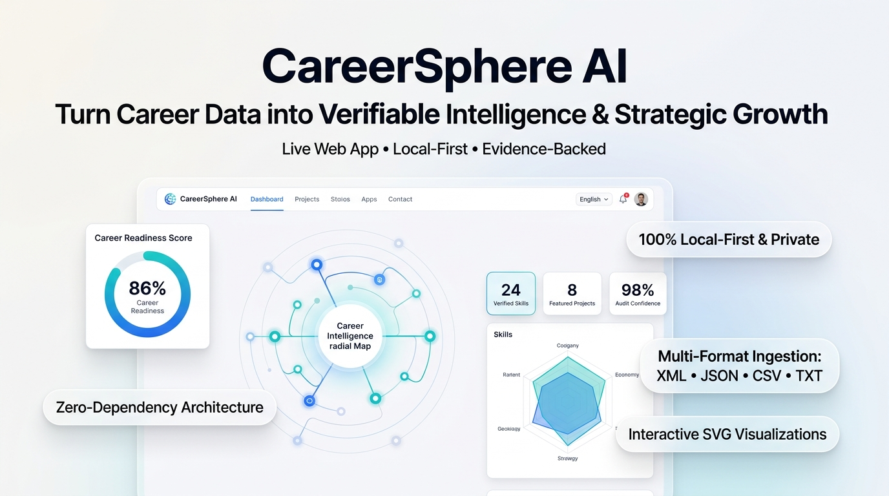

# 🚀 LinkedIn Announcement Post — CareerSphere AI

> **Attachment Image:** Use the generated **`image.png`** located in the root of the project repository when publishing this post on LinkedIn.

---

## 📋 Copy & Paste Content for LinkedIn

Most career tools fail for two reasons:
1. They upload your private career documents to opaque cloud servers.
2. They generate AI summaries with zero evidence, hallucinations, and no audit trail.

I wanted something different: **Deterministic, evidence-backed career intelligence that runs 100% privately in your browser.**

Today, I’m excited to open-source **CareerSphere AI** 🌐✨

---

### 💡 What is CareerSphere AI?

CareerSphere AI is a data-first, local-only single-page application that turns messy career documents (XML, JSON, CSV, plain-text resumes, and notes) into an interactive, visual career intelligence engine.

No build steps. No API keys. Zero server-side storage. Everything executes locally in client-side memory.

---

### 🔥 Key Features & Capabilities:

✅ **100% Local-First & Private:** Your resume, employment history, and personal data never leave your device (`localStorage` only).
✅ **Multi-Format Ingestion Engine:** Simultaneously parse and unify XML, JSON, CSV skill matrices, and unstructured TXT resumes into a normalized schema.
✅ **Verifiable Evidence & Audit Trails:** Every single skill and metric carries a provenance citation with confidence ratings. No hallucinated qualifications.
✅ **Interactive SVG Visualizations:** Custom handcrafted SVG radar charts, orbital Career Intelligence maps, readiness rings, and skill-to-project graphs.
✅ **Target Role Gap Analysis:** Benchmark your verified competencies against desired job profiles (Staff AI Engineer, Solutions Architect, etc.) to uncover exact learning roadmaps.
✅ **Executive Dossiers & PDF Reports:** Generate 5 print-ready, high-fidelity career reports and HTML downloads with clean `@media print` layouts.

---

### 🛠️ The Tech Stack:

- **Frontend Core:** Pure Vanilla JS / AngularJS 1.8 (locally vendored, zero CDN dependencies)
- **Data Engine:** Deterministic 7-stage pipeline (Ingestion ➔ Parsing ➔ Normalization ➔ Entity Extraction ➔ Relationship Building ➔ Analysis ➔ Visualization)
- **Styling:** Curated light/dark design system with glassmorphism, responsive CSS Grid, and custom SVG animations
- **Deployment:** Continuous delivery via GitHub Actions on GitHub Pages, with native Vercel, Netlify, and Docker support

---

### 🔗 Explore & Try It Live:

🌐 **Live Web Application:** https://vijaymahes9080.github.io/careersphere-AI/  
💻 **Open-Source GitHub Repo:** https://github.com/vijaymahes9080/careersphere-AI  

If you believe in local-first, privacy-respecting software and data-driven career planning, I’d love for you to check it out, test the demo datasets, and drop a ⭐ on GitHub!

What features would you love to see next in privacy-first career tools? Let me know in the comments below! 👇

---

#CareerIntelligence #OpenSource #WebDevelopment #JavaScript #PrivacyFirst #DataVisualization #SoftwareEngineering #TechCareers #Frontend #GitHub #Portfolio #AI
